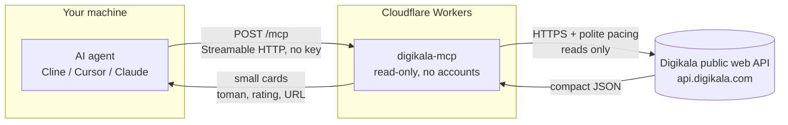

# Digikala MCP - shop intelligence for AI agents


[](https://github.com/mmdju/digikala-mcp/actions/workflows/verify.yml)


A public MCP server that gives AI agents **real data from Digikala** - Iran's largest online marketplace: search, **prices in Toman**, discounts, ratings, sellers, reviews, deals and bestsellers. **Read-only, no key needed.**

**Live endpoint:** `https://digikala-mcp.mmdju.workers.dev/mcp` (Streamable HTTP)

**[نسخه فارسی](README_FA.md)** · **[Examples](examples/sample-calls.md)** · **[Tool reference](docs/tools.md)** · **[Changelog](CHANGELOG.md)**

## Connect in 30 seconds

Any Streamable HTTP MCP client, **one URL**. Cline / Cursor / Claude Desktop (`mcp.json` style):

```json
{
  "mcpServers": {
    "digikala": { "url": "https://digikala-mcp.mmdju.workers.dev/mcp" }
  }
}
```

Then just talk: **"best Samsung phone under 100 million Toman"**, **"is this laptop any good?"**, **"what is on deal today?"**, **"what is popular in Iran right now?"**.

No client at hand? The whole protocol is one POST - a real call:

```bash
curl -sS https://digikala-mcp.mmdju.workers.dev/mcp \
  -H 'content-type: application/json' \
  -H 'accept: application/json, text/event-stream' \
  -d '{"jsonrpc":"2.0","id":1,"method":"tools/call","params":{"name":"search_digikala","arguments":{"query":"هدفون بی سیم","limit":2}}}'
```

And a real answer, trimmed to its bones (Toman, as JSON numbers):

```json
{
  "query": "هدفون بی سیم",
  "returned": 2,
  "items": [
    { "id": 5112620, "title": "هدفون بی سیم مدل P47 5.0+EDR", "price_toman": 800000, "rating_stars": 3.7, "url": "https://www.digikala.com/product/dkp-5112620/" },
    { "id": 19019009, "title": "هدفون بلوتوثی مدل P9 V5.3 ...", "price_toman": 900000, "rating_stars": 3, "url": "https://www.digikala.com/product/dkp-19019009/" }
  ]
}
```

## 19 tools, grouped by the question

**Find it**

| Tool | What it answers |
|---|---|
| `digikala_suggest` | Vague wording to **real search terms, category ids, trends** |
| `search_digikala` | "Show me X" - filters, sorting, paging |
| `browse_category` | Browse a category and **drill into sub-categories** |
| `browse_tag` | Digikala's **own tag shelves** - resolve a tag name, then browse it like a search |
| `search_filters` | "Which brands exist for X?" - **brand / colour / category ids + price range** |
| `brand_lookup` | Any brand name to its id, **Persian or English** |

**Know one product**

| Tool | What it answers |
|---|---|
| `product_details` | Everything about one product: **price, seller, warranty, specs, delivery** |
| `product_url` | Product id to **shareable URL** + title |
| `product_variants` | "Which colour is cheapest?" - **every variant with its own price and seller**, plus insurance, delivery and instalments |
| `product_sellers` | "Who else sells it, and are they reliable?" - **every storefront behind one product**, with Digikala's own performance numbers |
| `product_price_chart` | "Is now cheap?" - **short price history with seller per point** |
| `product_reviews` | "Is it any good?" - **buyer-only** and min-rating filters |
| `product_questions` | "What did buyers ask?" - questions with their answers, tagged seller / buyer / user |

**Decide**

| Tool | What it answers |
|---|---|
| `compare_products` | "Which of these?" - **only the specs that actually differ** |
| `find_best_value` | "Best X under Y Toman" - **ranked picks with seller grade** |
| `get_products_batch` | Shortlist cards for **up to 10 ids** - feeds `compare_products` |
| `similar_products` | "What else is like this?" - Digikala's own recommendations |

**What is hot**

| Tool | What it answers |
|---|---|
| `incredible_offers` | **Today's deals** (شگفت‌انگیز and the other promotion sections, incl. the DigiPlus early-access window) |
| `best_selling` | Site-wide bestsellers, with category ids to go deeper |

### Using it well

- **All prices are in Toman** (1 Toman = 10 Rial). Prices, stock and discounts **move constantly** - always link the product URL so the user can confirm before buying.
- Start vague queries with **`digikala_suggest`** to get real search terms and a `category_id`; get `brand_ids` from **`search_filters`** or **`brand_lookup`**.
- Anything with a **budget** or the word **"best"** goes to **`find_best_value`** - plain search only sees one page.
- Digikala's search **ORs its tokens**: results that only partially match come back flagged `low_confidence` with the exact `unmatched_terms`, and clamped pages report `page_clamped` instead of silently correcting.
- Results are **capped** (default 10, max 30) to protect agent context; specs are capped at 60 attributes unless narrowed.
- Product counts are **Digikala's own estimates** and drift between pages - treat them as approximate.
- **[examples/sample-calls.md](examples/sample-calls.md)** has nine copy-paste conversation flows; **[docs/tools.md](docs/tools.md)** is the full parameter reference.
- Persian queries are normalized with [fa-text-utils](https://github.com/mmdju/fa-text-utils) (yeh/kaf folding, Persian digits, ZWNJ variants).

## Reliability and limits

- **Free public service** on Cloudflare Workers. **20 requests per minute per IP** on POST /mcp (HTTP 429 + `retry-after`; the counter is Cloudflare's, per data centre). A full agent session - handshake, a search, a few detail reads, one comparison - measures at roughly 15-20 POSTs, so ordinary use never comes close.
- **A block is a wait, not a failure.** Digikala's CDN challenges some regions; the server waits it out with backoff instead of retrying in a burst. Short blocks turn into real answers; a block that outlasts the window returns one honest message asking for a retry in 15-30 seconds.
- **Polite pacing to Digikala:** one shared gate across every instance - at most **two upstream calls in flight, half a second apart**.
- **When a tag shelf will not answer**, `browse_tag` falls back to a plain search for the shelf's name and labels the answer `items_from_search: true` - never a silent substitute.
- **Nothing to sign up for.** No accounts, no sessions, no API keys, and nothing about you stored. What the server does keep: a short-lived **response cache** (Cloudflare's Cache API - minutes for prices, hours for reads that barely move), Digikala's own **bot-check cookie** (10 minutes, so one solved challenge covers every instance in the same data centre), and a temporary **failure log** (tool, error kind, status, request path, product id - never your query, your IP or a title; rows are pruned after 30 days).
- **Undocumented upstream.** Digikala's public API can change without notice - this service tracks it and adapts, which is exactly why the [verify script](scripts/verify-live.mjs) exists.

## How it works



One request in, one answer out - and nothing in that path stores who you are. The full picture is in [docs/architecture.md](docs/architecture.md).

## Trust, verified

Don't take my word for it - check the live server yourself:

```bash
node scripts/verify-live.mjs   # needs Node.js 18+, nothing to install
```

It checks the handshake, the live release against this repo's CHANGELOG, the tool list, a real search with a details read, and the two error paths. The same script runs **hourly in CI** ([](https://github.com/mmdju/digikala-mcp/actions/workflows/verify.yml)) - if the endpoint or Digikala's API drifts, the badge goes red. [examples/python.py](examples/python.py) is a copy-paste client (standard library only).

## Data source

Digikala's public web API (**undocumented, may change without notice**). This project is **not affiliated with or endorsed by Digikala**.

## License

Showcase repository - docs, examples and the standalone live-verify script, **no server source** - see [LICENSE](LICENSE). Security notes in [SECURITY.md](SECURITY.md). Persian version in [README_FA.md](README_FA.md).

*If this is useful, a star helps other builders find it.*
