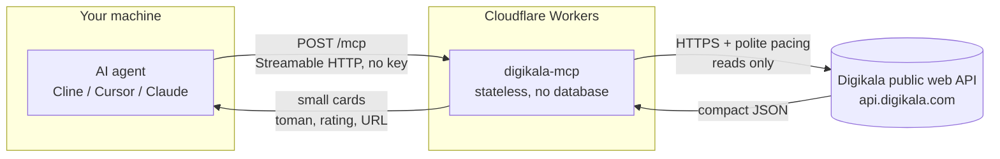

# دیجی‌کالا MCP - هوش خرید برای ایجنت‌ها


یه MCP سرور عمومیه که به ایجنت‌های هوش مصنوعی **دانش واقعی دیجی‌کالا** میده: جستجو، **قیمت به تومان**، تخفیف، نمره، فروشنده، دیدگاه، شگفت‌انگیزها و پرفروش‌ها. **فقط خواندنیه، بدون کلید.**

**آدرس زنده:** `https://digikala-mcp.mmdju.workers.dev/mcp` (Streamable HTTP، بدون state)

**[English version](README.md)** · **[مثال‌ها](examples/sample-calls.md)** · **[مرجع ابزارها](docs/tools.md)** · **[تغییرات](CHANGELOG.md)**

## اتصال در ۳۰ ثانیه

هر MCP کلاینتی، **فقط یه آدرس**. Cline / Cursor / Claude Desktop (استایل `mcp.json`):

```json
{
  "mcpServers": {
    "digikala": { "url": "https://digikala-mcp.mmdju.workers.dev/mcp" }
  }
}
```

بعدش فقط حرف بزن: **«بهترین گوشی سامسونگ زیر ۲۰ میلیون»**، **«این لپ‌تاپ خوبه؟»**، **«امروز چی تخفیف خورده؟»**، **«الان تو ایران چی پرفروشه؟»**.

از داخل مرورگر هم می‌شه وصل شد — آدرس به preflight کورس (`OPTIONS /mcp`) جواب می‌ده.

## ۱۶ ابزار

| ابزار | به چه دردی می‌خوره |
|---|---|
| `digikala_suggest` | حرف مبهم به **عبارت‌های واقعی جستجو، آیدی دسته، ترندها** |
| `search_digikala` | «اینو نشونم بده»، چک قیمت، فیلتر + مرتب‌سازی + صفحه‌بندی |
| `browse_category` | گشتن تو یه دسته و **رفتن تو زیردسته‌ها** |
| `product_details` | همه‌چیز یه کالا: **قیمت، فروشنده، گارانتی، مشخصات، دیدگاه** |
| `product_price_chart` | «الان ارزونه؟» — **تاریخچه کوتاه قیمت با فروشنده** |
| `product_questions` | «خریدارها چی پرسیدن؟» — پرسش‌ها + تعداد جواب |
| `get_products_batch` | کارت‌های **تا ۱۰ آیدی** — ورودی `compare_products` |
| `product_url` | آیدی کالا به **لینک قابل اشتراک** + عنوان |
| `product_variants` | «کدوم رنگ ارزون‌تره؟» — **همه رنگ‌ها با قیمت و فروشنده خودشون** |
| `search_filters` | «برای X چه برندهایی هست؟» — **آیدی برند/رنگ/دسته + رنج قیمت** |
| `product_reviews` | «خوبه؟» — **فقط خریدارها** و حداقل نمره |
| `compare_products` | «کدومشون؟» — **فقط مشخصاتی که واقعا فرق دارن** |
| `find_best_value` | «بهترین X زیر Y تومان» — **انتخاب‌های رتبه‌بندی‌شده با گرید فروشنده** |
| `incredible_offers` | **تخفیف‌های امروز** (شگفت‌انگیز + بقیه پروموشن‌ها) |
| `best_selling` | پرفروش‌های کل سایت، با آیدی دسته برای عمیق‌تر شدن |
| `similar_products` | «شبیه این چی هست؟» — پیشنهادهای خود دیجی‌کالا |

نکته‌ها برای سازنده‌های ایجنت:

- همه قیمت‌ها به **تومانن** (۱ تومان = ۱۰ ریال). قیمت و موجودی و تخفیف **مدام عوض میشن** — همیشه لینک کالا رو بده تا کاربر قبل خرید چک کنه.
- جستجوهای مبهم رو با **`digikala_suggest`** شروع کن تا عبارت واقعی و `category_id` بگیری.
- هرچی **بودجه** یا کلمه **«بهترین»** داره با **`find_best_value`** برو — سرچ ساده فقط یه صفحه رو می‌بینه.
- تعداد نتایج **تخمین خود دیجی‌کالاست** و بین صفحه‌ها جابه‌جا میشه — تقریبی حسابش کن.
- نتیجه‌ها **سقف دارن** (پیش‌فرض ۱۰، حداکثر ۳۰) تا کانتکست ایجنت حفظ بشه. مشخصات هم سقف ۶۰ تا دارن مگه اینکه محدودشون کنی.
- **هفت تا مکالمه آماده** کپی-پیست تو **[examples/sample-calls.md](examples/sample-calls.md)** هست، و مرجع کامل پارامترها تو **[docs/tools.md](docs/tools.md)**.

نکته: **فارسی رو می‌فهمه** — نیم‌فاصله، ی/ک عربی و ارقام فارسی با [fa-text-utils](https://github.com/mmdju/fa-text-utils) مرتب میشن (همون هلپرهای کوچیک، جدا منتشر شدن).

## چطور کار می‌کنه

سوال چطور به جواب تبدیل می‌شه. هیچ دیتای کاربری هیچ‌جای این مسیر ذخیره نمی‌شه.



این یعنی:

- **بدون state.** هر درخواست مستقله — بدون سشن، بدون اکانت، بدون لاگین.
- **فقط خواندنی.** هر ۱۶ ابزار `readOnlyHint` دارن. هیچ‌چیز این‌جا نمی‌تونه چیزی رو عوض کنه، پاک کنه یا سفارش بده.
- **بدون دیتای کاربر.** هیچ‌چیز از تو ذخیره نمی‌شه. سرور فقط دو چیز نگه می‌داره: یه کش کوتاه‌مدت جواب‌ها (چند دقیقه) و کوکی چالش امنیتی خود دیجی‌کالا (۱۰ دقیقه)، که یه بار حلش بقیه‌ی نمونه‌ها رو توی همون دیتاسنتر معاف می‌کنه. قیمت، موجودی و تخفیف هر بار که کش منقضی بشه دوباره از دیجی‌کالا خونده می‌شن.
- **مودب با ریت‌لیمیت.** درخواست‌ها با فاصله نیم‌ثانیه‌ای می‌رن؛ اگه دیجی‌کالا مقاومت کنه (چالش کوکی یا 429) با backoff نمایی و یه کم تصادف عقب می‌کشیم که retryها با هم هجوم نیارن — و ابزارهای لیستی هم به‌جای خطای کل، همون تکه‌ای که گرفتن رو با یه یادداشت برمی‌گردونن.
- **upstream مستند نیست.** وب API عمومی دیجی‌کالا می‌تونه بدون اطلاع عوض بشه — این سرویس دنبالش می‌کنه و خودش رو وفق می‌ده، و دقیقاً به همین دلیله که [اسکریپت verify](scripts/verify-live.mjs) وجود داره.

## اعتماد، قابل راستی‌آزمایی

حرف منو قبول نکن — خودت سرور زنده رو چک کن:

```bash
node scripts/verify-live.mjs   # فقط Node.js ۱۸ می‌خواد، نصب لازم نداره
```

هر ۱۶ ابزار رو لیست می‌کنه، یه سرچ + جزئیات + مسیرهای خطا رو اجرا می‌کنه و قرارداد صداقت دیتا رو چک می‌کنه. همون اسکریپت **هر ساعت تو CI** اجرا میشه ([](https://github.com/mmdju/digikala-mcp/actions/workflows/verify.yml)) — اگه endpoint یا API دیجی‌کالا عوض بشه بج قرمز میشه. معماری تو [docs/architecture.md](docs/architecture.md)، کلاینت آماده تو [examples/python.py](examples/python.py).

## منبع داده

وب API عمومی دیجی‌کالا (**مستند نیست، بدون اطلاع قبلی عوض میشه**). این پروژه **وابسته به دیجی‌کالا نیست** و تاییدش رو نداره.

## وضعیت

**سرویس عمومی رایگان** روی Cloudflare Workers. **سقفی روی درخواست‌های کلاینت نیست** — چیزی که سرور پِیس می‌کنه درخواست‌های خودش به دیجی‌کالاست: با فاصله‌ی نیم‌ثانیه و backoff وقتی دیجی‌کالا مقاومت کنه، پس استفاده‌ی عادی هیچ‌وقت شکل هجوم به خود نمی‌گیره.

## لایسنس

ریپوی ویترین (**فقط داک، بدون سورس**) — ببین [LICENSE](LICENSE). نکته‌های امنیتی تو [SECURITY.md](SECURITY.md).
