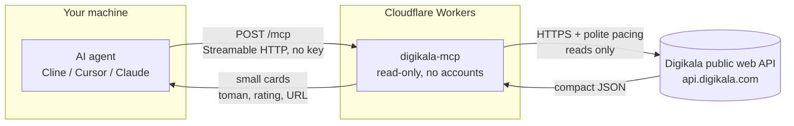

# دیجی‌کالا MCP - هوش خرید برای ایجنت‌ها


[](https://github.com/mmdju/digikala-mcp/actions/workflows/verify.yml)


یه MCP سرور عمومیه که به ایجنت‌های هوش مصنوعی **دیتای واقعی دیجی‌کالا** - بزرگترین فروشگاه اینترنتی ایران - می‌ده: جستجو، **قیمت به تومان**، تخفیف، نمره، فروشنده، دیدگاه، شگفت‌انگیزها و پرفروش‌ها. **فقط خواندنیه، بدون کلید.**

**آدرس زنده:** `https://digikala-mcp.mmdju.workers.dev/mcp` (Streamable HTTP)

**[English](README.md)** · **[مثال‌ها](examples/sample-calls.md)** · **[مرجع ابزارها](docs/tools.md)** · **[تغییرات](CHANGELOG.md)**

## اتصال در ۳۰ ثانیه

هر کلاینت Streamable HTTP MCP، **فقط یه آدرس**. Cline / Cursor / Claude Desktop (استایل `mcp.json`):

```json
{
  "mcpServers": {
    "digikala": { "url": "https://digikala-mcp.mmdju.workers.dev/mcp" }
  }
}
```

بعدش فقط حرف بزن: **«بهترین گوشی سامسونگ زیر ۱۰۰ میلیون»**، **«این لپ‌تاپ خوبه؟»**، **«امروز چی تخفیف خورده؟»**، **«الان تو ایران چی پرفروشه؟»**.

کلاینت نداری؟ کل پروتکل یه POSTه - یه تماس واقعی:

```bash
curl -sS https://digikala-mcp.mmdju.workers.dev/mcp \
  -H 'content-type: application/json' \
  -H 'accept: application/json, text/event-stream' \
  -d '{"jsonrpc":"2.0","id":1,"method":"tools/call","params":{"name":"search_digikala","arguments":{"query":"هدفون بی سیم","limit":2}}}'
```

و یه جواب واقعی، تا مغزش (تومان، به شکل عدد):

```json
{
  "query": "هدفون بی سیم",
  "returned": 2,
  "items": [
    { "id": 5112620, "title": "هدفون بی سیم مدل P47 5.0+EDR", "price_toman": 800000, "rating_stars": 3.7, "url": "https://www.digikala.com/product/dkp-5112620/" },
    { "id": 19019009, "title": "هدفون بلوتوثی مدل P9 V5.3 ...", "price_toman": 900000, "rating_stars": 3, "url": "https://www.digikala.com/product/dkp-19019009/" }
  ]
}
```

## ۱۹ ابزار، به تفکیک سوال

**پیدا کردن**

| ابزار | به چه دردی می‌خوره |
|---|---|
| `digikala_suggest` | حرف مبهم به **عبارت‌های واقعی جستجو، آیدی دسته، ترندها** |
| `search_digikala` | «اینو نشونم بده» - فیلتر، مرتب‌سازی، صفحه‌بندی |
| `browse_category` | گشتن تو یه دسته و **رفتن تو زیردسته‌ها** |
| `browse_tag` | قفسه‌های خود دیجی‌کالا - **اسم تگ رو به کد تبدیل کن و بگردش** |
| `search_filters` | «برای X چه برندهایی هست؟» - **آیدی برند/رنگ/دسته + رنج قیمت** |
| `brand_lookup` | **هر اسم برند به آیدیش**، فارسی یا انگلیسی |

**شناختن یه کالا**

| ابزار | به چه دردی می‌خوره |
|---|---|
| `product_details` | همه‌چیز یه کالا: **قیمت، فروشنده، گارانتی، مشخصات، ارسال** |
| `product_url` | آیدی کالا به **لینک قابل اشتراک** + عنوان |
| `product_variants` | «کدوم رنگ ارزون‌تره؟» - **همه رنگ‌ها با قیمت و فروشنده خودشون** + بیمه، ارسال و اقساط هر پیشنهاد |
| `product_sellers` | «کی دیگه می‌فروشه و چقدر مطمئنه؟» - **همه فروشگاه‌های پشت یه کالا، با آمار عملکرد دیجی‌کالا** |
| `product_price_chart` | «الان ارزونه؟» - **تاریخچه کوتاه قیمت با فروشنده** |
| `product_reviews` | «خوبه؟» - **فقط خریدارها** و حداقل نمره |
| `product_questions` | «خریدارها چی پرسیدن؟» - پرسش‌ها با جواب‌ها، مشخص شده کی جواب داده |

**انتخاب کردن**

| ابزار | به چه دردی می‌خوره |
|---|---|
| `compare_products` | «کدومشون؟» - **فقط مشخصاتی که واقعا فرق دارن** |
| `find_best_value` | «بهترین X زیر Y تومان» - **انتخاب‌های رتبه‌بندی‌شده با گرید فروشنده** |
| `get_products_batch` | کارت‌های **تا ۱۰ آیدی** - ورودی `compare_products` |
| `similar_products` | «شبیه این چی هست؟» - پیشنهادهای خود دیجی‌کالا |

**داغ‌های امروز**

| ابزار | به چه دردی می‌خوره |
|---|---|
| `incredible_offers` | **تخفیف‌های امروز** (شگفت‌انگیز و بقیه پروموشن‌ها، از جمله دسترسی زودتر دیجی‌پلاس) |
| `best_selling` | پرفروش‌های کل سایت، با آیدی دسته برای عمیق‌تر شدن |

### درست استفاده کردن

- همه قیمت‌ها به **تومانن** (۱ تومان = ۱۰ ریال). قیمت، موجودی و تخفیف **مدام عوض میشن** - همیشه لینک کالا رو بده تا کاربر قبل خرید چک کنه.
- جستجوهای مبهم رو با **`digikala_suggest`** شروع کن تا عبارت واقعی و `category_id` بگیری؛ `brand_ids` رو از **`search_filters`** یا **`brand_lookup`** بگیر.
- هرچی **بودجه** یا کلمه **«بهترین»** داره با **`find_best_value`** برو - سرچ ساده فقط یه صفحه رو می‌بینه.
- سرچ دیجی‌کالا **کلمه‌ها رو OR می‌کنه**: نتیجه‌ای که فقط بخشی از کوئری رو داشته باشه با `low_confidence` فلگ می‌خوره (با لیست دقیق `unmatched_terms`)، و صفحه‌هایی که بی‌سروصدا سقف می‌خورن خودشون رو با `page_clamped` می‌گن.
- نتیجه‌ها **سقف دارن** (پیش‌فرض ۱۰، حداکثر ۳۰) تا کانتکست ایجنت حفظ بشه؛ مشخصات هم سقف ۶۰ تا دارن مگه اینکه محدودشون کنی.
- تعداد نتایج **تخمین خود دیجی‌کالاست** و بین صفحه‌ها جابه‌جا می‌شه - تقریبی حسابش کن.
- **نه تا مکالمه آماده** کپی-پیست تو **[examples/sample-calls.md](examples/sample-calls.md)** هست، و مرجع کامل پارامترها تو **[docs/tools.md](docs/tools.md)**.
- فارسی رو می‌فهمه - نیم‌فاصله، ی/ک عربی و ارقام فارسی با [fa-text-utils](https://github.com/mmdju/fa-text-utils) مرتب میشن (همون هلپرهای کوچیک، جدا منتشر شدن).

## محدودیت‌ها و پایداری

- **سرویس عمومی رایگان** روی Cloudflare Workers. **۲۰ درخواست در دقیقه برای هر IP** روی POST /mcp (۴۲۹ با `retry-after` وقتی رد بشه؛ شمارنده مال سرویس ریت‌لیمیت کلاودفلره و به‌ازای هر دیتاسنتره). یه جلسه کامل ایجنت - هند‌شیک، یه سرچ، چند تا خوندن جزئیات، یه مقایسه - حدود ۱۵ تا ۲۰ تا POST می‌شه، پس استفاده معمولی هیچ‌وقت نزدیکش نمی‌شه.
- **بلاک یعنی صبر، نه خطا.** CDN دیجی‌کالا بعضی ناحیه‌ها رو چلنج می‌کنه؛ سرور با backoff صبرش رو می‌کشه، به‌جای اینکه پشت‌سرهم retry کنه. بلاک‌های کوتاه تبدیل به جواب واقعی می‌شن؛ بلاکی که از پنجره بیرون بزنه، یه پیام صادقانه می‌ده که «حدود ۱۵-۳۰ ثانیه بعد همون تماس رو تکرار کن».
- **مودب با دیجی‌کالا:** یه گیت مشترک بین همه نمونه‌ها - حداکثر **دو تماس upstream همزمان، با فاصله نیم‌ثانیه**.
- **اگه صفحه تگ جواب نده**، `browse_tag` می‌ره سراغ یه جستجوی ساده برای اسم همون قفسه و جواب رو با `items_from_search: true` برچسب می‌زنه - هیچ‌وقت جایگزینی بی‌سروصدا نمی‌کنه.
- **چیزی برای ثبت‌نام نیست.** بدون اکانت، بدون سشن، بدون کلید، و هیچ‌چیز از تو ذخیره نمی‌شه. چیزی که سرور نگه می‌داره: یه **کش کوتاه‌مدت جواب‌ها** (Cache API کلاودفلر - دقایقی برای قیمت‌ها، ساعت‌ها برای چیزهایی که کند عوض میشن)، **کوکی ضدبات خود دیجی‌کالا** (۱۰ دقیقه، که یه بار حلش بقیه نمونه‌های همون دیتاسنتر رو معاف می‌کنه)، و یه **لاگ موقت خطا** (ابزار، نوع خطا، وضعیت، مسیر درخواست، آیدی کالا - هیچ‌وقت کوئری، IP یا عنوان کالا؛ ردیف‌ها بعد از ۳۰ روز پاک میشن).
- **upstream مستند نیست.** وب API عمومی دیجی‌کالا می‌تونه بدون اطلاع عوض بشه - این سرویس دنبالش می‌کنه و خودش رو وفق می‌ده، و دقیقا به همین دلیله که [اسکریپت verify](scripts/verify-live.mjs) وجود داره.

## چطور کار می‌کنه


```mermaid
flowchart LR
    subgraph you [Your machine]
        agent[AI agent<br/>Cline / Cursor / Claude]
    end
    subgraph cf [Cloudflare Workers]
        worker[digikala-mcp<br/>read-only, no accounts]
    end
    dk[(Digikala public web API<br/>api.digikala.com)]

    agent -->|POST /mcp<br/>Streamable HTTP, no key| worker
    worker -->|HTTPS + polite pacing<br/>reads only| dk
    dk -->|compact JSON| worker
    worker -->|small cards<br/>toman, rating, URL| agent
```

یه درخواست میاد، یه جواب می‌ره - و هیچ‌جای این مسیر نمی‌دونه تو کی هستی. تصویر کامل تو [docs/architecture.md](docs/architecture.md).

## اعتماد، قابل راستی‌آزمایی

حرف منو قبول نکن - خودت سرور زنده رو چک کن:

```bash
node scripts/verify-live.mjs   # فقط Node.js ۱۸ می‌خواد، نصب لازم نداره
```

هند‌شیک، نسخه زنده در برابر CHANGELOG همین ریپو، لیست ابزارها، یه سرچ واقعی با خوندن جزئیات، و دو تا مسیر خطا رو چک می‌کنه. همون اسکریپت **هر ساعت تو CI** اجرا میشه ([](https://github.com/mmdju/digikala-mcp/actions/workflows/verify.yml)) - اگه endpoint یا API دیجی‌کالا عوض بشه بج قرمز می‌شه. [examples/python.py](examples/python.py) هم یه کلاینت آماده‌ست (فقط کتابخانه استاندارد).

## منبع داده

وب API عمومی دیجی‌کالا (**مستند نیست، بدون اطلاع قبلی عوض می‌شه**). این پروژه **وابسته به دیجی‌کالا نیست** و تاییدش رو نداره.

## لایسنس

ریپوی ویترین - داک، مثال‌ها و اسکریپت verify مستقل، **بدون سورس سرور** - ببین [LICENSE](LICENSE). نکته‌های امنیتی تو [SECURITY.md](SECURITY.md). نسخه انگلیسی تو [README.md](README.md).

*اگه به کارت اومد، یه ستاره کمک می‌کنه بقیه هم پیداش کنن.*
