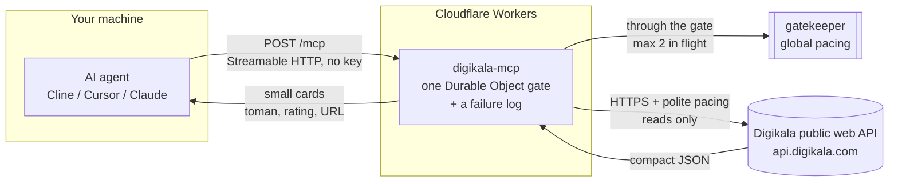

# Architecture

How a question becomes an answer. No user data is stored anywhere in this path.

```mermaid
flowchart LR
    subgraph you [Your machine]
        agent[AI agent<br/>Cline / Cursor / Claude]
    end
    subgraph cf [Cloudflare Workers]
        worker[digikala-mcp<br/>one Durable Object gate<br/>+ a failure log]
    end
    dk[(Digikala public web API<br/>api.digikala.com)]

    agent -->|POST /mcp<br/>Streamable HTTP, no key| worker
    worker -->|through the gate<br/>max 2 in flight| gate[[gatekeeper<br/>global pacing]]
    worker -->|HTTPS + polite pacing<br/>reads only| dk
    dk -->|compact JSON| worker
    worker -->|small cards<br/>toman, rating, URL| agent
```

What this means:

- **No sessions.** Every request stands alone - no accounts, nothing to log in to, nothing to resume.
- **Read-only.** All 19 tools carry `readOnlyHint`. Nothing here can change, delete or order anything.
- **No user data.** Nothing about you is stored. What the server does keep: a short-lived response cache (a few minutes), Digikala's own CDN bot-check cookie (10 minutes), and - in a D1 table - one row per *upstream failure* carrying only the tool name, error kind, status, request path and product id, pruned after 30 days. Never your query, your IP or a product title. Prices, stock and discounts are re-read from Digikala every time the cache expires.
- **One gate for everyone.** Upstream calls pass through a single Durable Object, so the "at most two in flight, half a second apart" number holds across every isolate and every data centre - a per-isolate counter cannot see the others. When Digikala pushes back - its cookie challenge or a 429 - the gate makes the whole service wait it out instead of retrying in a burst, and every way the gate itself can fail is fail-open: a gate that is slow or absent means "go ahead".
- **Rate-limited at the edge.** POST /mcp allows 20 requests a minute per IP, counted by Cloudflare's rate limiting binding across the whole edge location.
- **Undocumented upstream.** Digikala's public API can change without notice - this service tracks it and adapts, which is exactly why the [verify script](https://github.com/mmdju/digikala-mcp/blob/main/scripts/verify-live.mjs) exists.

Verify it yourself: `node scripts/verify-live.mjs` (needs node 18+, nothing to install).
